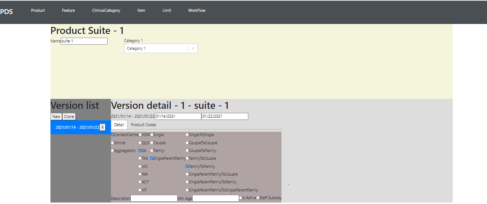

# product-design
Product Design front end (React & Redux)

This is a prototype to Create Insurance Products, Features, Items and Limits
Includes partial workflow design

The Aim for this project is to demonstrate the best practices and architecture for a react app and integration with a redux store

Demo Site : https://productdesign.z22.web.core.windows.net/

